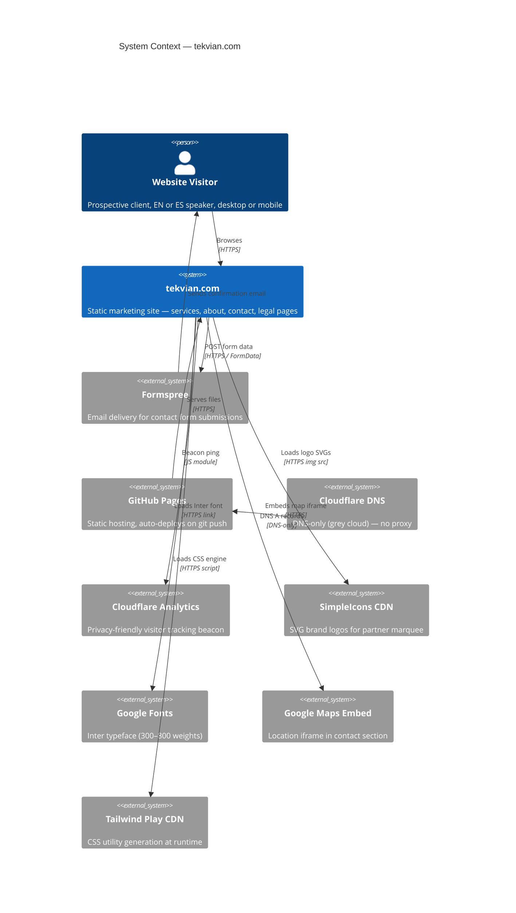
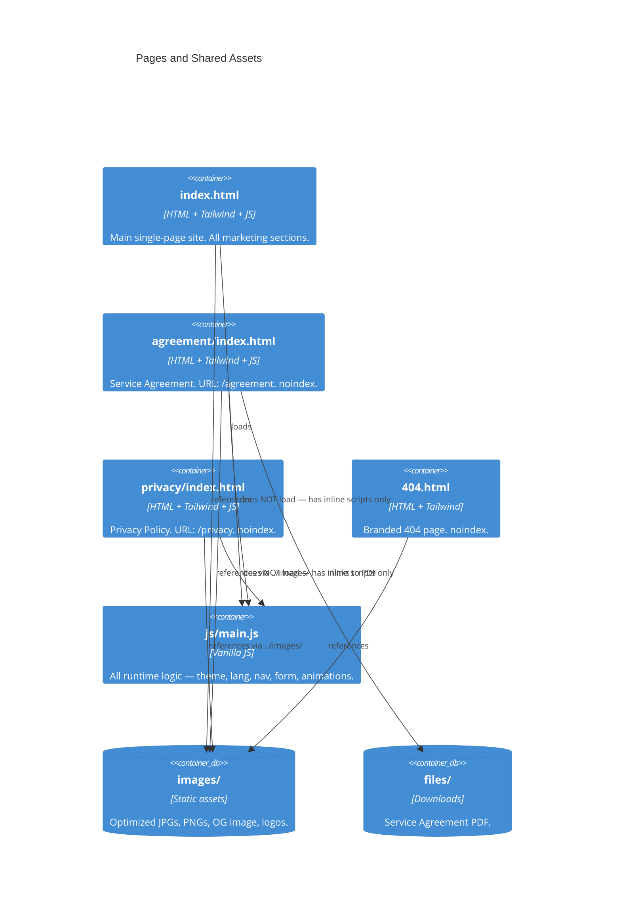
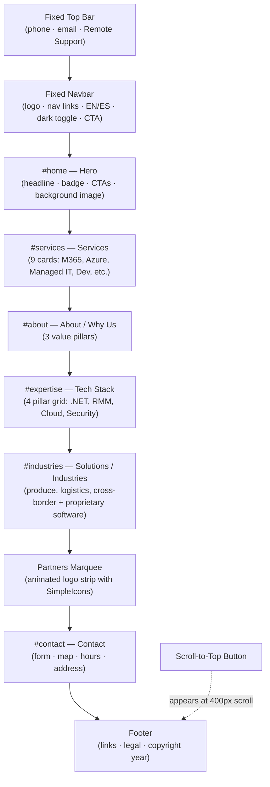
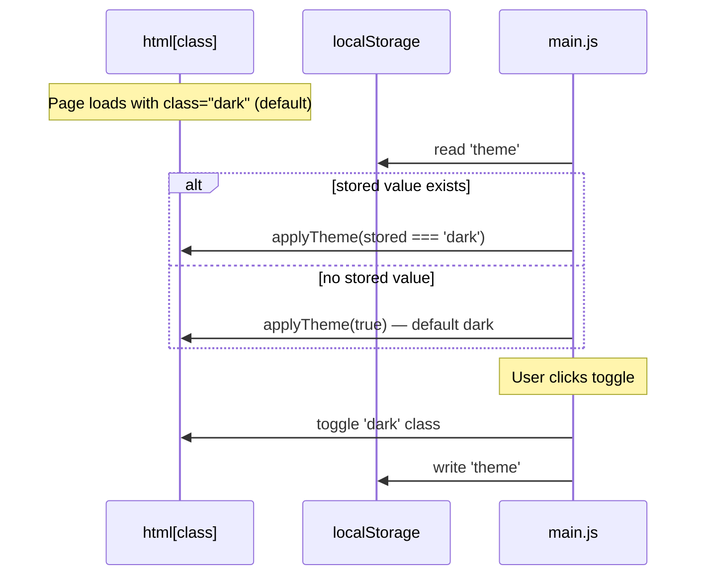
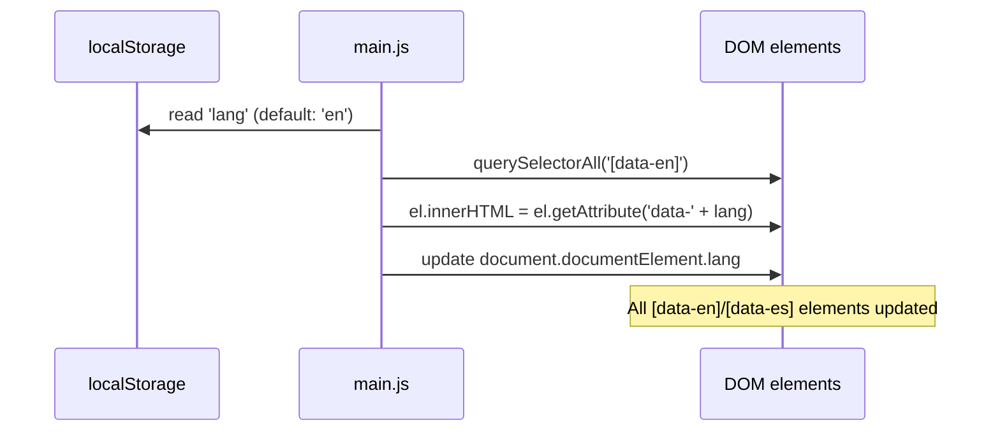
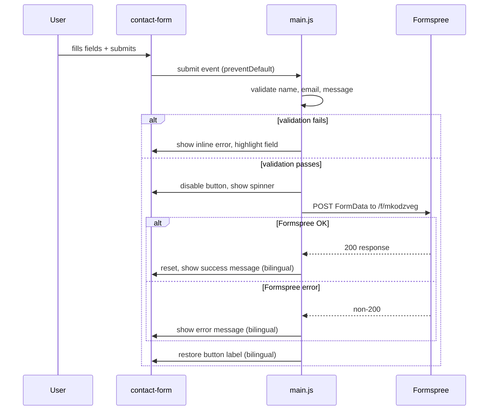

# Architecture Map — Tekvian Solutions Website

> **Living document.** Update this file whenever you add a page, change a data flow, add a dependency, or modify a core invariant. See the [Maintenance Process](#maintenance-process) section.

---

## System Context

---

## Container / Page Map

---

## Sections in index.html

---

## Data Flows

### Dark Mode

### Language Toggle

### Contact Form Submission

---

## Module / Component Catalog

### `js/main.js`
| Function | Responsibility | Key Invariant |
|---|---|---|
| `applyTheme(dark)` | Adds/removes `dark` from `<html>`, swaps sun/moon icons | Must always keep icon state in sync with class |
| `toggleTheme()` | Reads current state, flips, persists to localStorage | Persists as `'dark'` or `'light'` string |
| `initTheme()` (IIFE) | Runs on load — defaults to dark if no stored value | Default is **dark**, not light |
| `setLang(lang)` | Replaces innerHTML of all `[data-en]` elements, updates `<html lang>` | Uses `innerHTML` — safe only for trusted content |
| `initLang()` (IIFE) | Reads localStorage `'lang'`, calls `setLang` | Default is `'en'` |
| `toggleMobileMenu()` | Animates mobile menu via `maxHeight` + `opacity` | No CSS transitions — JS-driven |
| `closeMobileMenu()` | Collapses menu, resets icons and aria state | Called on outside click |
| Scroll listener | Adds `shadow-md` to navbar at 20px; shows scroll-top btn at 400px | Passive listener |
| `IntersectionObserver` | Adds `.visible` to `.animate-on-scroll` elements; staggers siblings by 80ms | One-shot (unobserve after trigger) |
| Form submit handler | Validates → POST to Formspree → bilingual feedback | Reads `form.action` for endpoint URL |
| Smooth scroll polyfill | `scrollIntoView` on `a[href^="#"]` clicks | Polyfill for older Safari |
| Footer year | Sets `#year` text to current year | — |

### HTML Pages
| File | URL | Indexed | Tailwind Config | JS |
|---|---|---|---|---|
| `index.html` | `/` | ✅ yes | Inline, full config | `js/main.js` |
| `agreement/index.html` | `/agreement` | ❌ noindex | Inline, full config | Inline only (TOC observer) |
| `privacy/index.html` | `/privacy` | ❌ noindex | Inline, full config | Inline only (TOC observer) |
| `404.html` | `/*` (catch-all) | ❌ noindex | Inline, partial | Inline only (year) |

### External Services
| Service | Purpose | Token / ID | Fallback |
|---|---|---|---|
| Formspree | Contact form email | `mkodzveg` | Error message shown to user |
| Cloudflare Analytics | Visitor tracking | `3ae66682cd3d4076a9004d1d80651326` | Silent failure |
| SimpleIcons CDN | Partner logo SVGs | n/a (slug in URL) | `onerror` shows text span |
| Google Fonts | Inter typeface | n/a | System font fallback in config |
| Google Maps | Contact section map | n/a (embed URL) | Visible if iframe blocked |
| Tailwind Play CDN | CSS utilities | n/a | Site unstyled without it |

---

## SEO & Crawl Rules
- **Indexed:** `/` only
- **Excluded from crawl:** `/agreement`, `/privacy` (robots.txt + `noindex` meta)
- **Sitemap:** `https://tekvian.com/sitemap.xml` — homepage only
- **Structured data:** `LocalBusiness` JSON-LD in `index.html`
- **OG image:** `https://tekvian.com/images/og-image.png` (1200×630)

---

## Critical Invariants (Do Not Break)
1. `<html class="scroll-smooth dark">` — dark class must be on `<html>` at parse time to prevent flash.
2. All `[data-en]` elements must also have `[data-es]` — `setLang` sets `innerHTML`, a missing attribute silently empties the element.
3. `agreement/` and `privacy/` image paths use `../images/` (relative) — changing to `/images/` breaks local `file://` preview.
4. The contact form `action` attribute is the live Formspree endpoint — do not remove or test submissions will go to production.
5. Partner logo `` tags must all have `onerror` handlers — CDN failures are silent otherwise.
6. Tailwind config blocks must be kept in sync across all HTML files (brand color palette, darkMode: 'class').

---

## Maintenance Process

### When to update this file
| Change | What to update |
|---|---|
| Add a new page | Container diagram, Sections diagram (if on index), Module catalog |
| Add/remove a nav link | Sections diagram |
| Add an external service | External Services table, System Context diagram |
| Change form endpoint | Contact Form flow diagram, External Services table |
| Add a new JS function | Module catalog |
| Change dark mode or lang logic | Relevant sequence diagram + Invariants |
| Add a new image or asset type | Module catalog (images row) |

### How to update
1. Edit the relevant Mermaid block directly — diagrams are source-of-truth.
2. Update `architecture.yaml` if structural (new page, new service, new invariant).
3. Commit alongside the code change in the same PR/commit.
